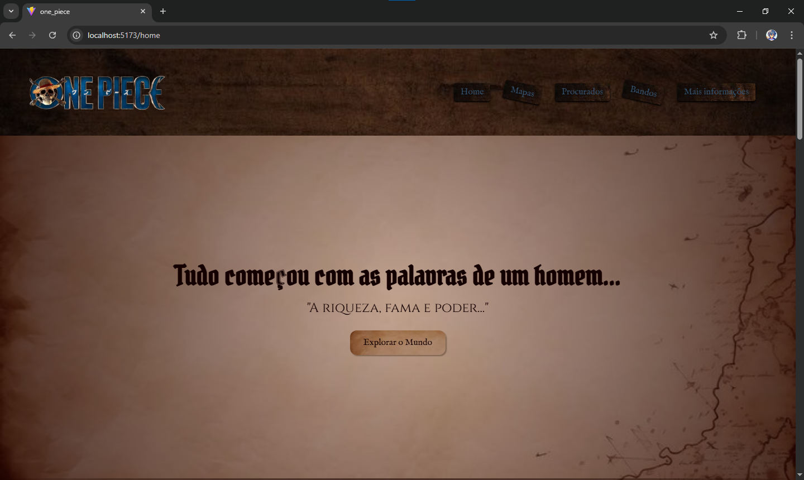

# 🏴‍☠️ One Piece Live Action - React Project (v1)

Projeto front-end desenvolvido com React, inspirado na estética da série One Piece (live-action). O objetivo foi criar uma experiência visual imersiva baseada no universo pirata, explorando conceitos de identidade visual, layout e organização de componentes.

---

## 🎯 Objetivo

Desenvolver um site temático com foco em interface (UI), simulando uma experiência dentro do mundo de One Piece, utilizando elementos visuais como mar, madeira e pergaminhos para reforçar a ambientação.

---

## 🚀 Tecnologias utilizadas

* React
* React Router
* CSS Modules
* JavaScript

---

## 🧩 Estrutura do projeto

O site é dividido em:

* **Intro**
  Tela inicial com transição imersiva para entrada no site

* **Home**

  * Header (navegação temática)
  * Hero Section (introdução visual)
  * Mapa do mundo
  * Cartazes de procurados (Wanted)
  * Locais da jornada
  * Footer

---

## 🎨 Conceito de Design

O design foi inspirado em:

* Estética pirata (madeira, mapas antigos, pergaminhos)
* Elementos marítimos (oceano, navegação)
* Tipografias temáticas

A proposta foi criar uma interface visualmente imersiva, mesmo sem foco inicial em usabilidade.

---

## ⚠️ Observações

Este projeto é uma **versão inicial (v1)** e teve como foco principal a construção visual e organização de layout.

Por se tratar de um projeto temático, aspectos de UX (experiência do usuário) não foram priorizados nesta etapa.

---

## 📈 Melhorias futuras

* Responsividade completa
* Ajustes de contraste e paleta de cores
* Melhor integração das imagens
* Animações e transições mais suaves
* Refinamento geral da interface

---

## 💡 Aprendizados

Durante o desenvolvimento deste projeto, foram trabalhados:

* Organização de componentes em React
* Estruturação de layout com CSS Modules
* Criação de interfaces temáticas
* Separação entre UI e UX

---

## 🧑‍💻 Autor

Desenvolvido por **Ernand Soares**

---

## 🌊 Considerações finais

Este projeto representa um passo importante na evolução como desenvolvedor front-end, com foco em construção visual e criatividade aplicada ao código.

---

> Inspirado na série One Piece (live-action)
